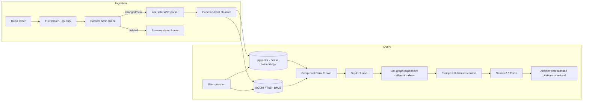

# 🔎 Codebase Intelligence Copilot

**Ask questions about an unfamiliar codebase from your terminal and get answers grounded in real code, with `path:line` citations.**

-brightgreen)  

```bash
cd /path/to/any/repo
codecopilot index      # index (or incrementally update) the current repo
codecopilot chat       # ask questions interactively
> what would break if I changed load_robot_types?
```

---

## 📌 The Problem

New engineers spend their first weeks reconstructing context that already exists in the repository:

- *Where is this API actually called from?*
- *Why is this module structured this way?*
- *What breaks if I change this function's signature?*

Generic code assistants only see the open file. Text search finds strings but not meaning. Senior engineers become the bottleneck because they're the only "index" of how the system fits together.

## 💡 The Solution

A retrieval-augmented copilot that indexes an entire repository and answers with **verifiable `path:line` citations**. When the retrieved code doesn't contain the answer, it says so instead of guessing.

Code is a strong domain for RAG because correctness is **checkable**: a citation either points at the right lines or it doesn't.

### What it does today
- Natural-language Q&A over a whole Python repo
- Exact identifier lookup via keyword search alongside semantic search
- Impact questions (*"what calls this, and what would break?"*) via call-graph expansion
- Mandatory `path:line` citations in every answer
- Refuses out-of-scope questions (e.g. asking about auth in a repo that has none)
- Incremental re-indexing: only changed, added, or deleted files are reprocessed
- Works on any repo from its own folder, and keeps multiple indexed repos separate
- Every call is traced to a local JSONL log (model, prompt version, latency, tokens) — a seed for the future Observability project, not a retrofit
- The prompt is a versioned template file (`prompts/answer_v1.txt`), not a string literal, so an answer can be traced back to exactly which version produced it

---

## 🎯 Where It Fits

- **Privacy-sensitive teams** that can't send code to third parties. Embeddings and the index already stay local. Swap Gemini for a local LLM and the whole pipeline is self-hosted.
- **Auditable answers in regulated settings**, where every claim must trace back to exact source lines.
- **A reusable retrieval layer** for other internal tools, such as review bots or onboarding guides.

---

## 🏗️ Architecture



### Request flow
1. **Detect changes:** hash every `.py` file and compare against the last run's state. Unchanged files are skipped, deleted files have their chunks removed.
2. **Parse:** build an AST per changed file with tree-sitter.
3. **Chunk:** one chunk per `function_definition` (methods inside classes included), with file path, function name, and line range as metadata.
4. **Embed and index:** a 384-dim embedding into pgvector, plus the raw text into a SQLite FTS5 table for BM25.
5. **Retrieve:** vector search and keyword search run in parallel, both scoped to the current repo, then merge via Reciprocal Rank Fusion (k=60).
6. **Expand:** for the top-ranked function, pull up to 2 callers and 2 callees, labeled as related context.
7. **Generate:** Gemini answers only from the assembled context, citing every claim, and declines when the context doesn't support an answer.

---

## 🧰 Tech Stack

| Layer | Choice | Why |
|---|---|---|
| Parsing | tree-sitter + tree-sitter-python | Error-tolerant AST with exact byte and line offsets |
| Embeddings | `all-MiniLM-L6-v2` (sentence-transformers, local) | Free, fast, no rate limits when embedding every function in a repo |
| Vector store | PostgreSQL + pgvector | Similarity search in plain SQL |
| Keyword search | SQLite FTS5 (BM25) | Literal identifiers that embeddings can miss |
| Fusion | Reciprocal Rank Fusion | Combines rankings without needing comparable scores |
| LLM | Gemini 2.5 Flash (google-genai) | Fast and cheap, with retry and exponential backoff via tenacity |
| CLI | Typer | `index` / `ask` / `chat` commands, defaulting to the current directory |
| Config | `python-dotenv` + typed `config.py` | One place for DB/model/retrieval settings; env vars namespaced `CODECOPILOT_*` instead of generic names |
| Tracing | Append-only JSONL (`tracing.py`) | Zero new infra; every call already has a span before the Observability project exists |

No LangChain or other RAG framework. Every stage is written by hand so each one can be measured and swapped.

---

## ⚖️ Key Design Decisions & Tradeoffs

| Decision | Chosen | Alternative | Why |
|---|---|---|---|
| Chunking | Function-level AST chunks | Fixed 50-line windows (Phase 1) | Fixed windows cut functions in half. Class wrappers were dropped to avoid storing the same code twice |
| Retrieval | Hybrid (vector + BM25) with RRF | Vector only | Exact function names get reliably found, and agreement between both signals outranks either alone |
| Embeddings | Local model | Gemini embedding API | Embedding is called once per function, so local means zero cost and no rate limits |
| Refusal | Prompt-level instruction | Distance threshold | Measured both; see the design log. The threshold was too fragile to ship |
| Change detection | Content hash per file | git diff / semantic diffing | Simple and repo-agnostic. A comment-only edit still re-indexes that one file, a cheap false positive |
| Multi-repo | Scope queries by repo path, one state file per repo | Separate DB per repo | One database serves many repos without results leaking between them |

---

## 📓 Design Log

Measured results and the decisions they drove.

| Phase | Change | Result | Decision |
|---|---|---|---|
| 1 | Naive RAG: 50-line chunks, vector search only | Worked end to end, but chunks split functions mid-body | Move to AST chunking |
| 2 | tree-sitter function-level chunking | Each chunk is exactly one function, line ranges verified against source | Kept |
| 2 | BM25 + Reciprocal Rank Fusion | Literal function-name queries reliably return the defining function | Kept |
| 3 | Gold-set eval (11 scored questions + trick questions) | **recall@3 = 90.9%, recall@5 = 100%, recall@10 = 100%** | Default `top_k = 5`: full recall without the cost of 10 chunks |
| 3 | Investigated the one early recall@5 miss | Traced to the function living in `ranking.py`, not where the label pointed | Fixed the label, recall@5 went from 90.9% to 100% |
| 3 | Distance threshold for refusal | Best relevant match ≈ 0.98, irrelevant matches 1.38–1.44, but ranks 5+ of relevant questions overlapped (1.27–1.38) | **Not shipped.** Prompt-level refusal already declined out-of-scope questions correctly |
| 3 | Analytical question: *"is exact-word search implemented?"* | Correctly separated BM25 from true exact match and noted that query sanitization strips punctuation | Kept as a qualitative example |
| 4 | Call-graph expansion | On a real backend repo, traced `load_robot_types` → `startup` → `mqtt_ingest.start_listening` with line citations | Kept. Little gain on tiny repos, clear gain on real ones |
| 4 | Duplicate function names across files | Name-only index silently overwrote entries | Keyed by `(file_path, function_name)`; callees prefer same-file matches |
| 5 | Hash-based incremental indexing | Unchanged repo: no work. One edited file: only that file re-indexed | Kept, plus cleanup of deleted files |
| 6 | Env-var config (`config.py`) | A generic `DB_HOST` key collided with an unrelated project's exported shell variable — silently connected to the wrong database | Namespaced every key as `CODECOPILOT_*` rather than relying on `.env` to override an already-set variable (it doesn't) |
| 6 | Prompt versioning + request tracing, added ahead of schedule | No retrieval change — this is infrastructure | Kept. The build guide warns that retrofitting this across later projects is miserable; cheaper to do it once, now |

---

## 📏 Metrics

| Metric | Status |
|---|---|
| Retrieval recall@k | ✅ Measured: recall@5 = 100% on the gold set |
| Refusal on out-of-scope questions | ✅ Checked manually on trick questions |
| Citation validity | 🟡 Checker implemented (`evaluation_loop.py`), not yet run across the full gold set |
| Latency P50 / P95 | 🟡 Instrumented (`tracing.py` → `traces.jsonl`, read by `latency_report.py`); not yet sampled across a representative run |

**Caveat:** the gold set is small (11 scored questions) and built on this project's own codebase. 100% recall here is a sanity check, not a benchmark. Expanding it to ~50 questions on an external repo is the next step.

---

## 🧗 Known Limitations

- **Python only.** Chunking and call extraction rely on Python grammar node types.
- **Function-level chunks only.** Module-level code such as imports, constants, and top-level scripts isn't indexed. Very long functions stay as one chunk.
- **Callee resolution is a heuristic.** Without import resolution, a call like `foo()` resolves to the same file first, then to any file defining `foo`.
- **Call graph is rebuilt per question.** Fine for small and medium repos, slow on large ones until it's cached.
- **No reranker or query rewriting yet** (originally planned for Phase 3).
- **Repo scoping uses a path prefix** (`LIKE '/repo/path%'`), so sibling folders sharing a prefix could overlap.

---

## 🚀 Getting Started

### Prerequisites
- Python 3.11+
- PostgreSQL with the pgvector extension. Homebrew's pgvector builds for PostgreSQL 17/18, so use `postgresql@17`
- A Gemini API key

### 1. Database setup
```sql
CREATE DATABASE codebase_copilot;
\c codebase_copilot
CREATE EXTENSION IF NOT EXISTS vector;

CREATE TABLE embeddings (
    id SERIAL PRIMARY KEY,
    sentence TEXT,              -- chunk text
    embedding vector(384),
    file_path TEXT,
    start_line INTEGER,
    end_line INTEGER,
    chunk_length INTEGER
);
```
Then set the connection details via environment variables — copy `.env.example` to `.env` (see step 2). Keys are namespaced `CODECOPILOT_*` so they won't collide with another project's env vars on your machine. The SQLite keyword index is created automatically on the first `index` run.

### 2. Install
```bash
git clone https://github.com/khushi0101/codebase-copilot.git
cd codebase-copilot
pip install -e .
cp .env.example .env               # fill in GEMINI_API_KEY; DB/model defaults work out of the box
```

### 3. Use
```bash
cd /path/to/repo/you/want/to/explore
codecopilot index                         # first run indexes everything, later runs only changes
codecopilot ask "where is the database connection set up?"
codecopilot chat                          # interactive session, type 'exit' to quit
python latency_report.py                  # P50/P95 latency from the trace log, once you've asked a few questions
```

---

## 📁 Repo Structure

```
codebase-copilot/
├── cli.py                 # Typer CLI: index / ask / chat
├── read_repo.py           # file walking + tree-sitter function-level chunking
├── incremental_index.py   # hash-based change detection, Postgres + SQLite indexing
├── seed_data.py           # full rebuild of the vector table
├── embedder.py            # sentence-transformers embedding
├── db_connection.py       # Postgres connection (reads config.py)
├── config.py              # typed, namespaced (CODECOPILOT_*) settings — DB, models, retrieval k, trace path
├── search_query.py        # repo-scoped vector search + BM25 keyword search
├── ranking.py             # Reciprocal Rank Fusion
├── call_graph.py          # caller/callee index + related-chunk lookup
├── prompt.py              # prompt assembly with labeled related context
├── prompt_registry.py     # loads versioned templates from prompts/
├── prompts/answer_v1.txt  # the versioned prompt template
├── tracing.py             # log_trace() + timed() — one JSON line per call, to traces.jsonl
├── latency_report.py      # P50/P95 latency computed from traces.jsonl
├── ask.py                 # retrieval → expansion → Gemini, with retries and tracing
├── gold_set.py            # hand-labeled question → expected function pairs
├── evaluation_script.py   # recall@k harness
├── evaluation_loop.py     # citation validity checker
└── pyproject.toml         # installs the `codecopilot` command
```

---

## 🗺️ Roadmap

- [x] **Phase 1 – Baseline:** fixed-size chunks, dense retrieval, answers with file paths
- [x] **Phase 2 – Structure:** AST chunking + BM25 + Reciprocal Rank Fusion
- [x] **Phase 3 – Measurement:** gold set, recall@k across k values, refusal analysis *(reranking and query rewriting still open)*
- [x] **Phase 4 – Grounding:** call-graph expansion, duplicate-name fix, citation checker
- [x] **Phase 5 – Freshness:** incremental re-indexing via content hashing, deleted-file cleanup
- [x] **CLI:** installable `codecopilot` command that works from any repo folder

**Next:**
- [ ] Multi-language support (JavaScript/TypeScript, Go) via per-language tree-sitter grammars
- [ ] Cross-encoder reranking, measured against current recall
- [ ] Larger external gold set (~50 questions) + citation validity numbers
- [x] Env-var config — typed `config.py`, namespaced `CODECOPILOT_*` env vars
- [ ] Cached call graph, hosted demo on a pre-indexed repo

### Non-goals (for now)
- Writing or editing code (this is a *reading* copilot)
- IDE plugin

---

## 🔗 Part of a Larger System

This is **layer 1 (Retrieval)** of a six-part AI engineering system:

| Layer | Repo |
|---|---|
| Retrieval | **codebase-copilot** (you are here) |
| Evals | [llm-eval-bench](https://github.com/khushi0101/llm-eval-bench) – scores this copilot's retrieval and answers |
| Agents | [sales-research-agent](https://github.com/khushi0101/sales-research-agent) |
| Automation | [lead-to-crm-automation](https://github.com/khushi0101/lead-to-crm-automation) |
| Observability | [ai-production-monitor](https://github.com/khushi0101/ai-production-monitor) – traces every call here |
| Guardrails | [ai-safety-gateway](https://github.com/khushi0101/ai-safety-gateway) – sits in front of this API |

---

## 👩‍💻 Author

**Khushi Agrawal** · [GitHub](https://github.com/khushi0101) · [LinkedIn](https://linkedin.com/in/khushi--agrawal)
