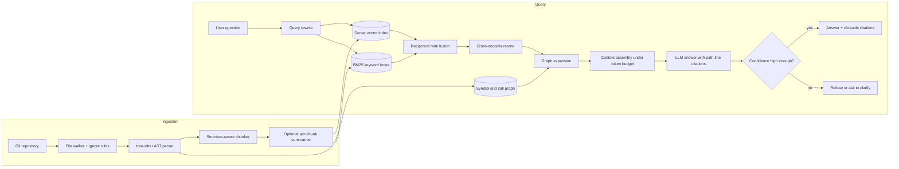

# 🔎 Codebase Intelligence Copilot

**Ask questions about a large, unfamiliar codebase and get answers grounded in real code, with citations down to the exact lines.**

  

> 🚧 **This project is in the design phase.** This README documents the problem, planned architecture, and tradeoffs. Progress is tracked in the [Roadmap](#-roadmap), and measured results will be added to the [Design Log](#-design-log) as each phase ships.

---

## 📌 The Problem

New engineers spend their first weeks reconstructing context that already exists in the repository:

- *Where is this API actually called from?*
- *Why is this module structured this way?*
- *What breaks if I change this function's signature?*

Generic code assistants only see the file that's open. Search tools find strings but not meaning. Senior engineers become the bottleneck because they're the only "index" of how the system fits together.

## 💡 The Solution

A retrieval-augmented copilot that indexes an **entire repository** (and later its git history) and answers questions with **verifiable `path:line` citations**. If it can't find strong evidence, it says so instead of guessing.

Code is a great domain for RAG because correctness is **checkable**: a citation either points at the right lines or it doesn't.

### Planned capabilities
- Natural-language Q&A over a whole repo
- Exact symbol lookup (`where is refresh_token defined?`)
- Call-graph questions (`what calls this, and what would break?`)
- Mandatory citations with clickable links to source lines
- Refusal when retrieval confidence is low
- Incremental re-indexing on every git push

---

## 🏗️ Architecture



### Request flow
1. **Ingest** – walk the repo, respect `.gitignore`, skip generated/vendored files.
2. **Parse** – build an AST per file with tree-sitter.
3. **Chunk** – split on syntactic boundaries (functions, classes, methods), attaching file path, symbol name, line range, imports, and commit SHA as metadata.
4. **Enrich** *(optional, measured)* – generate a one-line English summary per chunk so plain-English questions match code.
5. **Index** – dense embeddings for meaning + BM25 for exact identifiers + a symbol graph for relationships.
6. **Retrieve** – rewrite query → hybrid search → rank fusion → rerank top ~50 down to ~10.
7. **Expand** – pull callers, callees, and type definitions of retrieved symbols.
8. **Generate** – answer only from assembled context, with a citation for every claim.
9. **Gate** – if evidence is weak, refuse rather than hallucinate.

---

## 🧰 Tech Stack (planned)

| Layer | Choice | Why |
|---|---|---|
| Parsing | tree-sitter | Multi-language and error-tolerant (works on code that doesn't compile) |
| Embeddings | Code-tuned embedding model behind an interface | Swappable so models can be A/B tested |
| Vector store | pgvector (Postgres) | One database shared across all six projects |
| Keyword search | SQLite FTS5 / Postgres full-text (BM25) | Developers search literal identifiers constantly |
| Reranking | Cross-encoder | Big precision gain on the final context |
| API | FastAPI | Async, typed, easy to front with the safety gateway |
| Interface | CLI first → web UI with inline code viewer | Ship something usable early |

---

## ⚖️ Key Design Decisions & Tradeoffs

| Decision | Chosen | Alternative | Tradeoff |
|---|---|---|---|
| Chunking strategy | AST / syntactic chunks | Fixed token windows | Needs per-language parsing, but avoids functions split across chunks (a visible failure mode) |
| Retrieval | Hybrid (dense + BM25) | Dense only | More moving parts, but exact symbol names don't get lost |
| Vector DB | pgvector | Qdrant / LanceDB | Slower filtering at scale, but one DB for everything; kept behind an interface to swap later |
| Reranking | Cross-encoder on top 50 | No rerank | Adds latency, buys precision in the final context |
| Low confidence | Refuse | Always answer | Less "helpful" in edge cases, but a confident wrong citation destroys trust |
| Chunk summaries | Optional, A/B tested | Always / never | Index-time cost vs. better matching for English questions; decide with data |

---

## 🧗 Hard Problems I'm Planning For

- **Chunk size extremes** – a 900-line class won't fit; a 3-line getter is noise. → Hierarchical chunks (class summary + method detail) with parent links.
- **Near-duplicate code** – boilerplate floods the top-k. → Dedupe by content hash, down-weight generated paths.
- **Stale index** – citing deleted code is worse than no answer. → Version chunks by commit SHA; show index age in the UI.
- **Context budget** – code is verbose. → Keep signatures, strip comments and irrelevant helper bodies.
- **Multi-hop "why" questions** – need code + commits + issues. → Explicitly scoped to Phase 5, not faked earlier.

---

## 📏 How I'll Measure It

All numbers below are **targets**, not results. Real numbers go in the [Design Log](#-design-log).

| Metric | What it tells me | Target |
|---|---|---|
| Retrieval recall@10 / MRR | Is the right code being found? | recall@10 ≥ 0.80 on a 50-question gold set |
| Citation validity | Do cited lines actually support the claim? | ≥ 95% |
| Answer correctness | Rubric-graded on a fixed question set | Tracked per change via the eval bench |
| Latency | P50 / P95 end-to-end | P95 < 5s |
| Re-index time | Incremental update on a push | Seconds, not a full rebuild |

---

## 🗺️ Roadmap

- [ ] **Phase 1 – Baseline:** ingest one mid-sized repo, fixed-size chunks, dense retrieval, answers with file paths
- [ ] **Phase 2 – Structure:** AST chunking + BM25 + rank fusion; exact symbol queries always hit the defining chunk
- [ ] **Phase 3 – Measurement:** reranking, query rewriting, hand-labeled 50-question gold set, recall@10 reported before/after each change
- [ ] **Phase 4 – Grounding:** call-graph expansion + strict citation enforcement
- [ ] **Phase 5 – Freshness:** incremental re-indexing on `git diff`; index commit messages and PR descriptions

**Stretch:** multi-repo retrieval · "blast radius" mode for symbol changes · onboarding mode that generates a reading order for new contributors

### Non-goals (for now)
- Writing or editing code (this is a *reading* copilot)
- IDE plugin (web/CLI first)
- Guaranteeing answers to questions whose answer isn't in the repo

---

## 📁 Planned Repo Structure

```
codebase-copilot/
├── ingest/          # repo walker, tree-sitter parsing, chunking
├── index/           # embeddings, vector + BM25 indexes, symbol graph
├── retrieval/       # query rewrite, fusion, rerank, graph expansion
├── generation/      # prompt templates, citation enforcement, refusal logic
├── api/             # FastAPI service
├── ui/              # web UI with citation viewer
├── evals/           # gold question set + scripts (run by llm-eval-bench)
├── docs/decisions/  # short design notes (ADRs)
└── tests/
```

---

## 🔗 Part of a Larger System

This is **layer 1 (Retrieval)** of a six-part AI engineering system:

| Layer | Repo |
|---|---|
| Retrieval | **codebase-copilot** (you are here) |
| Evals | [llm-eval-bench](https://github.com/khushi0101/llm-eval-bench) – scores this copilot's retrieval and answers |
| Agents | [sales-research-agent](https://github.com/khushi0101/sales-research-agent) |
| Automation | [lead-to-crm-automation](https://github.com/khushi0101/lead-to-crm-automation) |
| Observability | [ai-production-monitor](https://github.com/khushi0101/ai-production-monitor) – traces every call here |
| Guardrails | [ai-safety-gateway](https://github.com/khushi0101/ai-safety-gateway) – sits in front of this API |

---

## 🎬 Planned Demo

Point it at a well-known open-source repo and ask three escalating questions: a **lookup** ("where is auth token refresh implemented?"), a **trace** ("what calls this, and what breaks if I change the signature?"), and a **why** ("why does this function swallow that exception?"). Click a citation to land on the exact lines, then show recall before vs. after AST chunking.

---

## 🚀 Getting Started

*Coming with Phase 1.* Setup instructions, environment variables, and a sample repo to index will be added here.

---

## 📓 Design Log

Measured results and decisions, added as each phase ships.

| Date | Change | Metric | Before → After | Decision |
|---|---|---|---|---|
| – | – | – | – | – |

---

## 👩‍💻 Author

**Khushi Agrawal** · [GitHub](https://github.com/khushi0101) · [LinkedIn](https://linkedin.com/in/khushi--agrawal)
